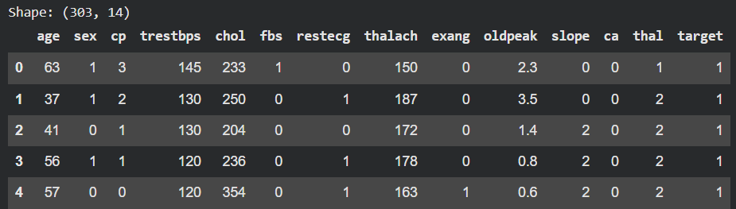
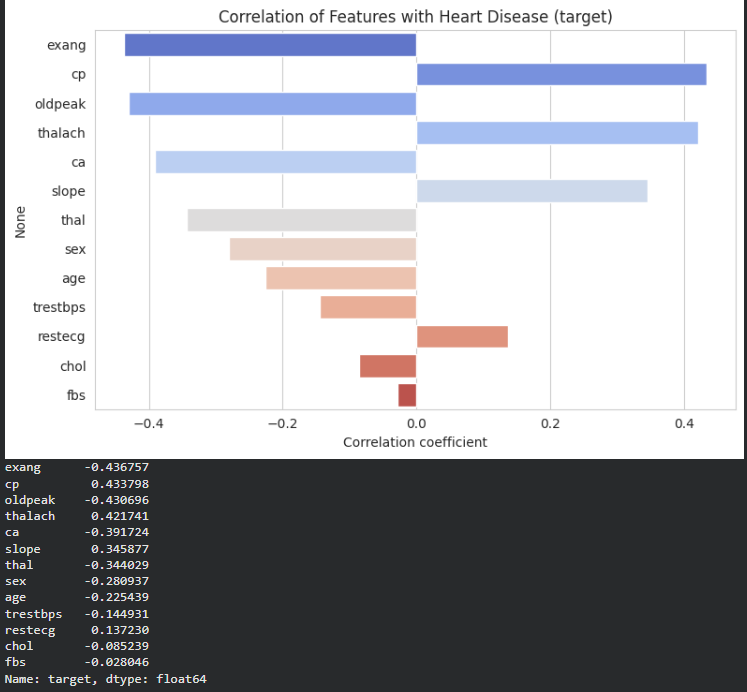
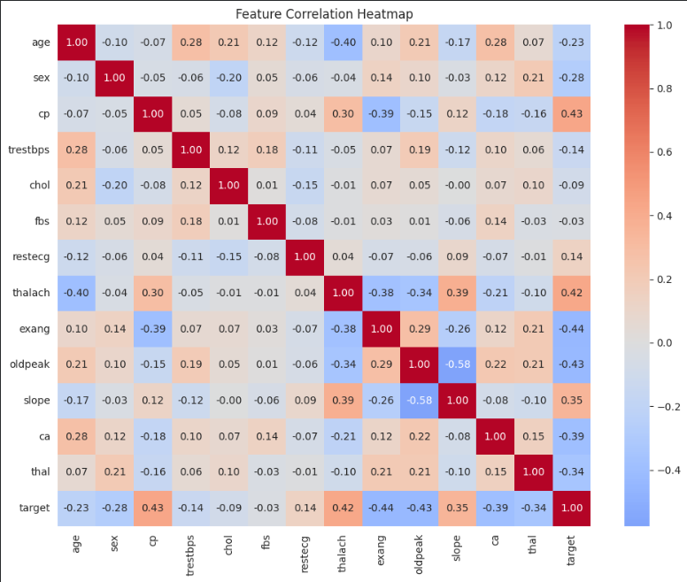
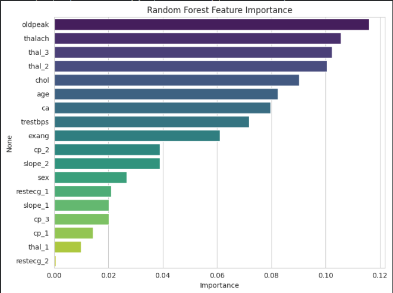
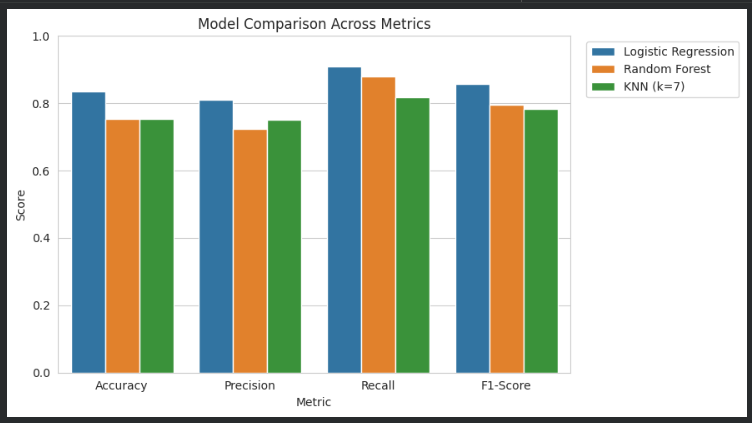
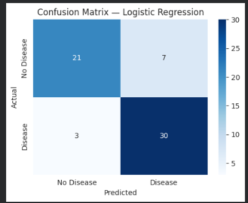

# Heart-Disease-Prediction-Project

# ❤️ Heart Disease Prediction using Machine Learning

A Machine Learning project that predicts the presence of heart disease using patient health records from the UCI Cleveland Heart Disease Dataset. The project compares multiple classification algorithms and identifies the best-performing model based on evaluation metrics and medical relevance.

---

## 📌 Project Overview

Heart disease is one of the leading causes of death worldwide. Early prediction can help healthcare professionals make timely decisions and improve patient outcomes.

This project explores the UCI Cleveland Heart Disease dataset and builds predictive models to determine whether a patient is likely to have heart disease based on clinical indicators such as chest pain type, cholesterol level, blood pressure, maximum heart rate, and other medical attributes.

The project follows a complete Machine Learning workflow:

* Data Loading
* Data Exploration
* Data Preprocessing
* Feature Engineering
* Model Training
* Model Evaluation
* Model Comparison
* Best Model Selection

---

## 🎯 Objectives

* Analyze patient health data.
* Identify important risk factors associated with heart disease.
* Perform data preprocessing and feature engineering.
* Train multiple machine learning models.
* Compare model performance using evaluation metrics.
* Select the most effective model for prediction.
* Generate meaningful healthcare insights through visualization.

---

## 🛠️ Tech Stack

* Python
* Pandas
* NumPy
* Matplotlib
* Seaborn
* Scikit-Learn
* Jupyter Notebook

---

## 📂 Project Structure

```text
Heart-Disease-Prediction/
│
├── Project02_Heart_Disease_Prediction.ipynb
├── heart.csv
├── README.md
│
├── assets/
│   ├── dataset_preview.png
│   ├── feature_correlation.png
│   ├── correlation_heatmap.png
│   ├── feature_importance.png
│   ├── model_comparison.png
│   └── confusion_matrix.png
```

---

## 📊 Dataset

Dataset: UCI Cleveland Heart Disease Dataset

* Total Records: 303
* Features: 14
* Target Classes:

  * 1 → Heart Disease Present
  * 0 → No Heart Disease

The Cleveland subset commonly used in machine learning studies contains 303 patient records and focuses on predicting heart disease using 14 key attributes.

---

## ⚙️ Data Preprocessing

### Data Cleaning

* Verified dataset structure and data types.
* Confirmed absence of missing values.
* Examined target class distribution.

### Feature Engineering

One-Hot Encoding applied to:

* Chest Pain Type (cp)
* Resting ECG (restecg)
* Slope
* Thalassemia

Dataset expanded from:

```text
303 × 14
```

to

```text
303 × 20
```

after encoding.

---

## 📈 Visualizations

### 1. Dataset Overview

Displays the first few records and dataset information.



---

### 2. Feature Correlation with Heart Disease

Shows the relationship between individual features and the target variable.



---

### 3. Correlation Heatmap

Visualizes correlations among all features.



---

### 4. Random Forest Feature Importance

Highlights the most influential features for prediction.



---

### 5. Model Performance Comparison

Compares Accuracy, Precision, Recall, and F1-Score across all models.



---

### 6. Confusion Matrix

Displays prediction performance of the best model.



---

## 🤖 Models Used

### Logistic Regression

* Linear Classification Model
* Uses StandardScaler
* Highly Interpretable

### Random Forest

* Ensemble Learning Model
* Handles Complex Relationships
* Robust to Noise

### K-Nearest Neighbors (KNN)

* Distance-Based Classification
* Uses StandardScaler
* k = 7

---

## 🏆 Results

| Model               | Accuracy | Precision | Recall | F1-Score |
| ------------------- | -------- | --------- | ------ | -------- |
| Logistic Regression | 83.61%   | 81.08%    | 90.91% | 85.71%   |
| Random Forest       | 75.41%   | 72.50%    | 87.88% | 79.45%   |
| KNN (k=7)           | 75.41%   | 75.00%    | 81.82% | 78.26%   |

### Best Model: Logistic Regression

* Accuracy: 83.61%
* Precision: 81.08%
* Recall: 90.91%
* F1-Score: 85.71%

---

## 🔍 Key Findings

### ❤️ Chest Pain Type is a Strong Indicator

Chest pain type showed one of the strongest positive correlations with heart disease.

### ❤️ Maximum Heart Rate Matters

Patients with higher maximum heart rates exhibited stronger relationships with disease prediction.

### ❤️ Exercise-Induced Angina is Significant

Exercise-induced angina was strongly associated with heart disease presence.

### ❤️ Logistic Regression Performed Best

Among all models tested, Logistic Regression achieved the highest overall performance.

### ❤️ High Recall is Clinically Important

The model successfully identified more than 90% of heart disease cases, reducing the risk of missed diagnoses.

---

## 💡 Healthcare Insights

### Insight 1

Chest pain type and maximum heart rate are among the most influential predictors of heart disease.

### Insight 2

Exercise-induced angina and ST depression significantly impact disease prediction.

### Insight 3

Simple linear relationships within the dataset favor Logistic Regression over more complex algorithms.

### Insight 4

A high recall score is particularly valuable in healthcare applications because missing a positive case can have severe consequences.

### Insight 5

Machine Learning can serve as a useful decision-support tool for preliminary heart disease screening.

---

## 🚀 Future Enhancements

* Hyperparameter Tuning
* Cross Validation
* Streamlit Dashboard Deployment
* Flask Web Application
* XGBoost Implementation
* Real-Time Prediction System
* Healthcare Decision Support Integration

---

## 📚 Dataset Source

UCI Cleveland Heart Disease Dataset

Official Source:
https://archive.ics.uci.edu/ml/datasets/Heart+Disease

---

## ⭐ Support

If you found this project useful, consider giving the repository a ⭐ on GitHub.
